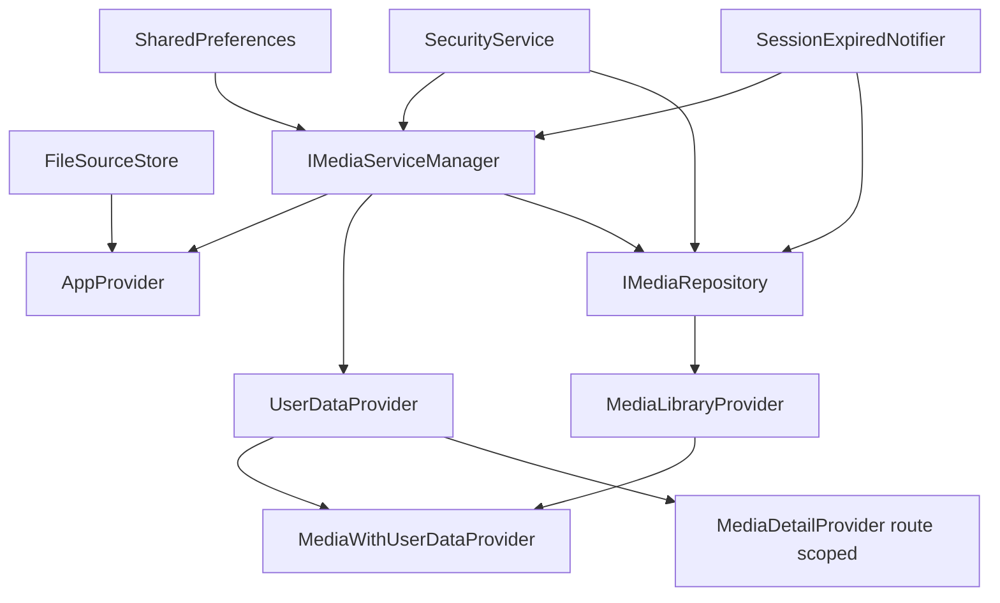

# MeowHub 项目架构与数据流转技术文档

本文基于当前仓库实现整理，目标是从工程实践角度说明 MeowHub 的整体分层、依赖注入、核心数据流、播放子系统协同关系，以及当前值得继续优化的方向。

主要参考文件：

- [lib/main.dart](/Users/yunlang/meowhub/meowhub/lib/main.dart)
- [lib/providers/media_library_provider.dart](/Users/yunlang/meowhub/meowhub/lib/providers/media_library_provider.dart)
- [lib/providers/media_with_user_data_provider.dart](/Users/yunlang/meowhub/meowhub/lib/providers/media_with_user_data_provider.dart)
- [lib/providers/media_detail_provider.dart](/Users/yunlang/meowhub/meowhub/lib/providers/media_detail_provider.dart)
- [lib/providers/user_data_provider.dart](/Users/yunlang/meowhub/meowhub/lib/providers/user_data_provider.dart)
- [lib/ui/responsive/media_detail_view.dart](/Users/yunlang/meowhub/meowhub/lib/ui/responsive/media_detail_view.dart)
- [lib/ui/responsive/player_view.dart](/Users/yunlang/meowhub/meowhub/lib/ui/responsive/player_view.dart)
- [lib/ui/atoms/meow_video_player.dart](/Users/yunlang/meowhub/meowhub/lib/ui/atoms/meow_video_player.dart)
- [lib/data/repositories/emby_media_repository_impl.dart](/Users/yunlang/meowhub/meowhub/lib/data/repositories/emby_media_repository_impl.dart)
- [lib/data/repositories/emby_playback_repository_impl.dart](/Users/yunlang/meowhub/meowhub/lib/data/repositories/emby_playback_repository_impl.dart)
- [lib/data/repositories/watch_history_repository_impl.dart](/Users/yunlang/meowhub/meowhub/lib/data/repositories/watch_history_repository_impl.dart)
- [lib/data/datasources/emby_api_client.dart](/Users/yunlang/meowhub/meowhub/lib/data/datasources/emby_api_client.dart)
- [lib/data/datasources/emby_watch_history_remote_data_source.dart](/Users/yunlang/meowhub/meowhub/lib/data/datasources/emby_watch_history_remote_data_source.dart)

## 1. 架构概览

MeowHub 当前采用的是一种接近 Clean Architecture 的 Flutter 分层实现，核心可以概括为：

```text
Flutter UI
  -> Provider 状态层
    -> Domain Repository / UseCase
      -> Data Repository Impl
        -> Remote / Local DataSource
          -> EmbyApiClient
            -> Emby Server
```

更具体地说：

- `main.dart` 是应用启动入口，同时也是依赖装配中心。
- `ui/` 负责页面和组件。
- `providers/` 负责展示态、页面编排、用户数据管理。
- `domain/` 负责实体、仓库抽象和少量 use case。
- `data/` 负责 DTO、仓库实现、数据源适配和 HTTP 调用。
- `core/` 负责安全存储、配置持久化、ticks 转换、会话通知等基础设施。

## 2. 核心分层说明

### 2.1 Presentation 层

Presentation 层由 `ui/` 和 `providers/` 共同构成。

职责：

- 负责页面渲染、交互响应、路由跳转。
- 负责把多个领域数据源组合成适合 UI 消费的展示态。
- 不直接处理 JSON、HTTP 协议、Emby DTO。

主要组成：

- 页面与组件：
  - [lib/ui/responsive/home_view.dart](/Users/yunlang/meowhub/meowhub/lib/ui/responsive/home_view.dart)
  - [lib/ui/responsive/media_detail_view.dart](/Users/yunlang/meowhub/meowhub/lib/ui/responsive/media_detail_view.dart)
  - [lib/ui/responsive/player_view.dart](/Users/yunlang/meowhub/meowhub/lib/ui/responsive/player_view.dart)
  - [lib/ui/mobile/player/mobile_player_screen.dart](/Users/yunlang/meowhub/meowhub/lib/ui/mobile/player/mobile_player_screen.dart)
  - [lib/ui/tablet/player/tablet_player_screen.dart](/Users/yunlang/meowhub/meowhub/lib/ui/tablet/player/tablet_player_screen.dart)
- 状态管理：
  - [lib/providers/media_library_provider.dart](/Users/yunlang/meowhub/meowhub/lib/providers/media_library_provider.dart)
  - [lib/providers/media_with_user_data_provider.dart](/Users/yunlang/meowhub/meowhub/lib/providers/media_with_user_data_provider.dart)
  - [lib/providers/media_detail_provider.dart](/Users/yunlang/meowhub/meowhub/lib/providers/media_detail_provider.dart)
  - [lib/providers/user_data_provider.dart](/Users/yunlang/meowhub/meowhub/lib/providers/user_data_provider.dart)

说明：

- `MediaLibraryProvider` 负责媒体库基础列表状态。
- `MediaWithUserDataProvider` 负责把媒体库和用户数据合并成“带收藏、带续播进度”的最终列表。
- `MediaDetailProvider` 负责详情页的剧集选择和续播定位。
- `UserDataProvider` 负责收藏、观看历史、播放进度及其同步逻辑。

### 2.2 Domain 层

Domain 层由 `domain/entities`、`domain/repositories`、`domain/usecases` 构成。

职责：

- 定义业务实体和稳定的抽象接口。
- 隔离上层对具体 Emby 实现的依赖。
- 承载少量通用业务调用入口。

主要组成：

- 实体：
  - [lib/domain/entities/media_item.dart](/Users/yunlang/meowhub/meowhub/lib/domain/entities/media_item.dart)
  - [lib/domain/entities/playback_plan.dart](/Users/yunlang/meowhub/meowhub/lib/domain/entities/playback_plan.dart)
  - [lib/domain/entities/watch_history_item.dart](/Users/yunlang/meowhub/meowhub/lib/domain/entities/watch_history_item.dart)
- 仓库抽象：
  - [lib/domain/repositories/i_media_repository.dart](/Users/yunlang/meowhub/meowhub/lib/domain/repositories/i_media_repository.dart)
  - [lib/domain/repositories/playback_repository.dart](/Users/yunlang/meowhub/meowhub/lib/domain/repositories/playback_repository.dart)
  - [lib/domain/repositories/watch_history_repository.dart](/Users/yunlang/meowhub/meowhub/lib/domain/repositories/watch_history_repository.dart)
- UseCase：
  - [lib/domain/usecases/get_playback_plan.dart](/Users/yunlang/meowhub/meowhub/lib/domain/usecases/get_playback_plan.dart)
  - [lib/domain/usecases/update_watch_progress.dart](/Users/yunlang/meowhub/meowhub/lib/domain/usecases/update_watch_progress.dart)

说明：

- `MediaItem` 是 UI 和业务逻辑的通用实体。
- `PlaybackPlan` 是播放前构建出的播放方案，包含播放 URL、媒体源、音轨、字幕、章节、标记、`PlaySessionId`。
- `IMediaRepository` 抽象媒体内容访问。
- `PlaybackRepository` 抽象播放方案获取。
- `WatchHistoryRepository` 抽象播放进度和历史同步。

### 2.3 Data 层

Data 层由 `data/repositories`、`data/datasources`、`data/models` 构成。

职责：

- 实现 Domain 中定义的仓库接口。
- 调用 Emby HTTP API。
- 在 DTO、JSON、Domain Entity 之间做转换。
- 协调本地缓存和远端数据源。

主要组成：

- 仓库实现：
  - [lib/data/repositories/emby_media_repository_impl.dart](/Users/yunlang/meowhub/meowhub/lib/data/repositories/emby_media_repository_impl.dart)
  - [lib/data/repositories/emby_playback_repository_impl.dart](/Users/yunlang/meowhub/meowhub/lib/data/repositories/emby_playback_repository_impl.dart)
  - [lib/data/repositories/watch_history_repository_impl.dart](/Users/yunlang/meowhub/meowhub/lib/data/repositories/watch_history_repository_impl.dart)
- 数据源：
  - [lib/data/datasources/emby_api_client.dart](/Users/yunlang/meowhub/meowhub/lib/data/datasources/emby_api_client.dart)
  - [lib/data/datasources/emby_watch_history_remote_data_source.dart](/Users/yunlang/meowhub/meowhub/lib/data/datasources/emby_watch_history_remote_data_source.dart)
  - [lib/data/datasources/local_watch_history_data_source.dart](/Users/yunlang/meowhub/meowhub/lib/data/datasources/local_watch_history_data_source.dart)
- 模型与映射：
  - `data/models/emby/*`
  - [lib/data/models/emby/emby_media_mapper.dart](/Users/yunlang/meowhub/meowhub/lib/data/models/emby/emby_media_mapper.dart)

说明：

- `EmbyApiClient` 是面向 Emby 协议的最底层 HTTP Client。
- 各 Repository Impl 按业务域分别封装媒体内容、播放方案、播放历史。
- `WatchHistoryRepositoryImpl` 同时协调本地进度存储和远端进度上报。

## 3. 依赖注入（DI）链路

当前依赖注入中心位于 [lib/main.dart](/Users/yunlang/meowhub/meowhub/lib/main.dart#L41)。

### 3.1 启动阶段初始化

在 `main()` 中初始化了以下基础依赖：

- `SharedPreferences`
- `SecurityService`
- `SessionExpiredNotifier`
- `FileSourceStore`
- `IMediaServiceManager`

对应位置：

- [lib/main.dart:41](/Users/yunlang/meowhub/meowhub/lib/main.dart#L41)
- [lib/domain/repositories/i_media_service_manager.dart](/Users/yunlang/meowhub/meowhub/lib/domain/repositories/i_media_service_manager.dart)

这些对象构成了全局运行环境：

- `SharedPreferences` 保存基础配置。
- `SecurityService` 保存密码、Token、UserId 等敏感信息。
- `SessionExpiredNotifier` 作为登录状态失效通知器。
- `FileSourceStore` 负责文件源持久化。
- `IMediaServiceManager` 负责当前媒体服务配置的加载、校验、切换。

### 3.2 MultiProvider 注入关系

`MeowHubApp.build()` 中使用 `MultiProvider` 装配了应用运行时对象。

依赖拓扑如下：



对应代码：

- `AppProvider`
  - 依赖 `IMediaServiceManager + FileSourceStore`
  - [lib/main.dart:183](/Users/yunlang/meowhub/meowhub/lib/main.dart#L183)
- `IMediaServiceManager`
  - 通过 `.value` 注入
  - [lib/main.dart:191](/Users/yunlang/meowhub/meowhub/lib/main.dart#L191)
- `MediaConfigValidator`
  - 通过 `.value` 注入，供配置页调用 `verifyConfig`
  - [lib/main.dart:208](/Users/yunlang/meowhub/meowhub/lib/main.dart#L208)
- `UserDataProvider`
  - 通过 `ChangeNotifierProxyProvider<IMediaServiceManager, WatchHistoryRepository, UserDataProvider>` 注入
  - [lib/main.dart:194](/Users/yunlang/meowhub/meowhub/lib/main.dart#L194)
- `SecurityService`
  - 通过 `.value` 注入
  - [lib/main.dart:205](/Users/yunlang/meowhub/meowhub/lib/main.dart#L205)
- `SessionExpiredNotifier`
  - 通过 `.value` 注入
  - [lib/main.dart:206](/Users/yunlang/meowhub/meowhub/lib/main.dart#L206)
- `IMediaRepository`
  - 通过 `ProxyProvider3` 动态构建
  - [lib/main.dart:209](/Users/yunlang/meowhub/meowhub/lib/main.dart#L209)
- `MediaLibraryProvider`
  - 依赖 `IMediaRepository`
  - [lib/main.dart:224](/Users/yunlang/meowhub/meowhub/lib/main.dart#L224)
- `MediaWithUserDataProvider`
  - 依赖 `MediaLibraryProvider + UserDataProvider`
  - [lib/main.dart:236](/Users/yunlang/meowhub/meowhub/lib/main.dart#L236)

### 3.3 IMediaRepository 的动态构建

`_buildMediaRepository()` 决定了媒体内容仓库的最终实现：

- 开启 `USE_MOCK_REPOSITORY` 时返回 `MockMediaRepositoryImpl`
- 没有有效 Emby 配置时返回 `EmptyMediaRepositoryImpl`
- 正常情况下构建 `EmbyApiClient`，再返回 `EmbyMediaRepositoryImpl`

对应代码：

- [lib/main.dart:274](/Users/yunlang/meowhub/meowhub/lib/main.dart#L274)

这使得 `MediaLibraryProvider` 等上层对象只依赖 `IMediaRepository` 抽象，不直接依赖 Emby。

## 4. 核心业务流转：用户点击播放一个视频

下面以“用户从详情页点击播放一个视频”为例，说明完整的数据流向。

### 4.1 详情页加载

进入 `MediaDetailView` 后，页面在 `initState()` 中调用：

```text
context.read<IMediaRepository>().getMediaDetail(widget.mediaItem)
```

对应代码：

- [lib/ui/responsive/media_detail_view.dart:31](/Users/yunlang/meowhub/meowhub/lib/ui/responsive/media_detail_view.dart#L31)

实际执行链路：

```text
MediaDetailView
  -> IMediaRepository.getMediaDetail()
    -> EmbyMediaRepositoryImpl.getMediaDetail()
      -> EmbyApiClient.getMediaItemDetail()
      -> EmbyApiClient.getEpisodes() / getPlaybackInfo() 按需补充
      -> DTO -> MediaItem
```

`EmbyMediaRepositoryImpl.getMediaDetail()` 做了几件事：

- 获取详情 DTO
- 转换为 `MediaItem`
- 为剧集容器补充 `playableItems`
- 为电影尝试补充字幕流信息

对应代码：

- [lib/data/repositories/emby_media_repository_impl.dart:45](/Users/yunlang/meowhub/meowhub/lib/data/repositories/emby_media_repository_impl.dart#L45)

### 4.2 详情页点击播放

在 `MediaDetailView` 中，点击播放会触发 `handlePlayPressed()`：

- 从当前剧集列表中选出目标 `MediaItem`
- 从 `UserDataProvider` 取最新播放进度
- 用最新进度覆盖待播放的 `MediaItem`
- 调用 `markRecentlyWatchedItemMemoryOnly()` 做一次内存级预更新
- 跳转到 `PlayerView`

对应代码：

- [lib/ui/responsive/media_detail_view.dart:83](/Users/yunlang/meowhub/meowhub/lib/ui/responsive/media_detail_view.dart#L83)

这里的设计目的是：在正式打开播放器前，先把“最近观看”和“当前选中的续播点”同步到应用内状态，避免 UI 断层。

### 4.3 PlayerView 建立播放会话

`PlayerView` 是播放页的入口协调器。

初始化逻辑：

- 先从 `UserDataProvider` 中读取已保存进度，作为 `_initialPosition`
- 调用 `_preparePlaybackPlan()`

对应代码：

- [lib/ui/responsive/player_view.dart:152](/Users/yunlang/meowhub/meowhub/lib/ui/responsive/player_view.dart#L152)

`_preparePlaybackPlan()` 内部通过 `_fetchPlaybackPlan()` 获取 `PlaybackPlan`：

```text
PlayerView
  -> GetPlaybackPlanUseCase
    -> PlaybackRepository.getPlaybackPlan()
      -> EmbyPlaybackRepositoryImpl.getPlaybackPlan()
        -> EmbyApiClient.getPlaybackInfo()
```

对应代码：

- [lib/ui/responsive/player_view.dart:168](/Users/yunlang/meowhub/meowhub/lib/ui/responsive/player_view.dart#L168)
- [lib/ui/responsive/player_view.dart:233](/Users/yunlang/meowhub/meowhub/lib/ui/responsive/player_view.dart#L233)
- [lib/domain/usecases/get_playback_plan.dart:5](/Users/yunlang/meowhub/meowhub/lib/domain/usecases/get_playback_plan.dart#L5)
- [lib/domain/repositories/playback_repository.dart:4](/Users/yunlang/meowhub/meowhub/lib/domain/repositories/playback_repository.dart#L4)
- [lib/data/repositories/emby_playback_repository_impl.dart:33](/Users/yunlang/meowhub/meowhub/lib/data/repositories/emby_playback_repository_impl.dart#L33)

`PlayerView` 会校验：

- `PlaybackPlan.url` 不为空
- `PlaybackPlan.playSessionId` 不为空

对应代码：

- [lib/ui/responsive/player_view.dart:223](/Users/yunlang/meowhub/meowhub/lib/ui/responsive/player_view.dart#L223)

### 4.4 Emby 返回 PlaybackInfo

`EmbyApiClient.getPlaybackInfo()` 会向 Emby 发送：

```text
POST /emby/Items/{itemId}/PlaybackInfo
```

请求体包含：

- `UserId`
- `DeviceId`
- `ItemId`
- `StartTimeTicks`
- `MaxStreamingBitrate`
- `AudioStreamIndex`
- `SubtitleStreamIndex`
- `MediaSourceId`
- `PlaySessionId`
- `DeviceProfile`

对应代码：

- [lib/data/datasources/emby_api_client.dart:272](/Users/yunlang/meowhub/meowhub/lib/data/datasources/emby_api_client.dart#L272)

`EmbyPlaybackRepositoryImpl` 之后会：

- 选择最佳 `MediaSource`
- 生成最终播放 URL
- 映射音轨与字幕
- 解析章节和片头片尾标记
- 生成 `PlaybackPlan`

对应代码：

- [lib/data/repositories/emby_playback_repository_impl.dart:94](/Users/yunlang/meowhub/meowhub/lib/data/repositories/emby_playback_repository_impl.dart#L94)

### 4.5 进入播放器并开始播放

当 `PlaybackPlan` 准备完成后，`PlayerView` 会把以下信息传给 `MobilePlayerScreen` 或 `TabletPlayerScreen`：

- `playUrlOverride`
- `playSessionId`
- `mediaSourceId`
- `audioStreamIndex`
- `subtitleStreamIndex`
- 初始进度与字幕配置

对应代码：

- [lib/ui/responsive/player_view.dart:443](/Users/yunlang/meowhub/meowhub/lib/ui/responsive/player_view.dart#L443)

底层播放器 `MeowVideoPlayer` 会监听 `media_kit` 的流，并持续向上层派发统一的 `MeowVideoPlaybackStatus`：

- `position`
- `duration`
- `isInitialized`
- `isPlaying`
- `isBuffering`
- `isCompleted`

对应代码：

- [lib/ui/atoms/meow_video_player.dart:352](/Users/yunlang/meowhub/meowhub/lib/ui/atoms/meow_video_player.dart#L352)

一旦检测到“已初始化且开始播放”，还会额外派发一次 `onPlaybackStarted`：

- [lib/ui/atoms/meow_video_player.dart:394](/Users/yunlang/meowhub/meowhub/lib/ui/atoms/meow_video_player.dart#L394)

## 5. 播放子系统专题：PlaybackPlan 与 WatchHistory 汇报链路

播放子系统是本项目最关键的一组协同逻辑，主要由两条链组成：

- `PlaybackPlan` 链，负责“如何播放”
- `WatchHistory` 链，负责“如何汇报播放状态”

### 5.1 PlaybackPlan 链

职责：

- 建立播放会话
- 取得播放 URL
- 获取 `PlaySessionId`
- 获取音轨、字幕、章节、片头片尾标记

链路如下：

```text
PlayerView
  -> GetPlaybackPlanUseCase
    -> PlaybackRepository
      -> EmbyPlaybackRepositoryImpl
        -> EmbyApiClient.getPlaybackInfo()
          -> Emby /Items/{id}/PlaybackInfo
        -> PlaybackPlan
```

最终产物 `PlaybackPlan` 包含：

- `url`
- `isTranscoding`
- `playSessionId`
- `mediaSourceId`
- `audioStreams`
- `subtitleStreams`
- `chapters`
- `markers`

关键位置：

- [lib/data/repositories/emby_playback_repository_impl.dart:141](/Users/yunlang/meowhub/meowhub/lib/data/repositories/emby_playback_repository_impl.dart#L141)

这里最重要的字段是 `playSessionId`，因为它是后续汇报链路的会话上下文。

### 5.2 WatchHistory 汇报链

职责：

- 本地维护最新播放进度
- 周期性向 Emby 汇报播放进度
- 在开始播放和退出播放时明确发送开始/结束事件

链路如下：

```text
MeowVideoPlayer status
  -> MobilePlayerScreen / TabletPlayerScreen
    -> UserDataProvider
      -> WatchHistoryRepository
        -> LocalWatchHistoryDataSource
        -> EmbyWatchHistoryRemoteDataSource
          -> EmbyApiClient.reportPlaybackAction()
            -> Emby Sessions API
```

### 5.3 播放器事件如何进入上报链路

以移动端为例：

- 开始播放时调用 `UserDataProvider.startPlaybackForItem()`
- 普通播放过程中调用 `syncProgressToServerForItem()`
- 退出播放器时调用 `stopPlaybackForItem()`

对应代码：

- [lib/ui/mobile/player/mobile_player_screen.dart:305](/Users/yunlang/meowhub/meowhub/lib/ui/mobile/player/mobile_player_screen.dart#L305)
- [lib/ui/mobile/player/mobile_player_screen.dart:398](/Users/yunlang/meowhub/meowhub/lib/ui/mobile/player/mobile_player_screen.dart#L398)
- [lib/ui/mobile/player/mobile_player_screen.dart:476](/Users/yunlang/meowhub/meowhub/lib/ui/mobile/player/mobile_player_screen.dart#L476)

`UserDataProvider` 会先更新内存态，再决定是否真正发网络请求：

- `startPlaybackForItem()` 触发开始事件
- `syncProgressToServerForItem()` 内部带 15 秒节流
- `stopPlaybackForItem()` 触发停止事件并在结束后回刷历史

对应代码：

- [lib/providers/user_data_provider.dart:428](/Users/yunlang/meowhub/meowhub/lib/providers/user_data_provider.dart#L428)
- [lib/providers/user_data_provider.dart:470](/Users/yunlang/meowhub/meowhub/lib/providers/user_data_provider.dart#L470)
- [lib/providers/user_data_provider.dart:521](/Users/yunlang/meowhub/meowhub/lib/providers/user_data_provider.dart#L521)

### 5.4 WatchHistoryRepository 的协同策略

`WatchHistoryRepositoryImpl` 的核心策略是：

- 先更新本地 `LocalWatchHistoryDataSource`
- 如果来源是 Emby，再同步到远端

对应代码：

- [lib/data/repositories/watch_history_repository_impl.dart:49](/Users/yunlang/meowhub/meowhub/lib/data/repositories/watch_history_repository_impl.dart#L49)

这使得：

- UI 和续播数据不必完全依赖网络返回
- 网络失败时本地仍可保留当前进度
- 后续可以继续扩展更多来源类型

### 5.5 Emby 远端上报链路

`EmbyWatchHistoryRemoteDataSourceImpl` 会把三种动作映射为统一的 `_report()` 调用：

- `startPlayback()` -> `PlaybackAction.start`
- `updateProgress()` -> `PlaybackAction.progress`
- `stopPlayback()` -> `PlaybackAction.stop`

对应代码：

- [lib/data/datasources/emby_watch_history_remote_data_source.dart:38](/Users/yunlang/meowhub/meowhub/lib/data/datasources/emby_watch_history_remote_data_source.dart#L38)

最终由 `EmbyApiClient.reportPlaybackAction()` 发送到 Emby：

- `start` -> `/emby/Sessions/Playing`
- `progress` -> `/emby/Sessions/Playing/Progress`
- `stop` -> `/emby/Sessions/Playing/Stopped`

对应代码：

- [lib/data/datasources/emby_api_client.dart:455](/Users/yunlang/meowhub/meowhub/lib/data/datasources/emby_api_client.dart#L455)

请求体包含：

- `UserId`
- `ItemId`
- `PositionTicks`
- `RunTimeTicks`
- `PlaySessionId`
- `MediaSourceId`
- `AudioStreamIndex`
- `SubtitleStreamIndex`

### 5.6 PlaybackPlan 与 WatchHistory 的协同关系

二者的协同点在于：`PlaybackPlan` 提供播放会话上下文，`WatchHistory` 带着这个上下文进行持续汇报。

核心关联字段：

- `playSessionId`
- `mediaSourceId`
- `audioStreamIndex`
- `subtitleStreamIndex`

协同逻辑可以概括为：

```text
PlaybackPlan 负责回答：
  - 播什么
  - 从哪播
  - 用什么媒体源播
  - 当前会话 ID 是什么

WatchHistory 负责回答：
  - 已经播到哪了
  - 什么时候开始
  - 什么时候停止
  - 是否需要向 Emby 同步
```

## 6. 当前架构的优点

- 分层边界整体清晰，媒体内容链路已经较稳定。
- `main.dart` 统一承担组合根职责，依赖注入关系比较集中。
- UI 基本消费 `MediaItem` 和 `PlaybackPlan` 等领域实体，而不是直接使用 DTO。
- `WatchHistoryRepositoryImpl` 将本地缓存与远端同步做了统一协调。
- `PlaybackPlan` 与播放汇报链路已经能围绕 `PlaySessionId` 形成闭环。

## 7. 待优化建议

### 7.1 PlayerView 仍直接依赖 Data 实现

当前 `PlayerView` 自己构建了 `EmbyApiClient` 和 `EmbyPlaybackRepositoryImpl`：

- [lib/ui/responsive/player_view.dart:135](/Users/yunlang/meowhub/meowhub/lib/ui/responsive/player_view.dart#L135)

这意味着播放方案这条链路没有完全纳入 composition root，Presentation 层感知了 Data 层细节。

建议：

- 把 `PlaybackRepository` 或 `GetPlaybackPlanUseCase` 也纳入 `MultiProvider`
- 让 `PlayerView` 只依赖抽象或 use case

### 7.2 UserDataProvider 职责过重

当前 `UserDataProvider` 同时承担了：

- 收藏管理
- 历史记录管理
- 续播进度内存态
- 播放会话活动状态
- 音轨/字幕选择缓存
- 进度节流同步
- 后台轮询历史刷新
- 仓库构建逻辑

对应文件：

- [lib/providers/user_data_provider.dart](/Users/yunlang/meowhub/meowhub/lib/providers/user_data_provider.dart)

建议：

- 将播放会话与上报逻辑抽出为 `PlaybackSessionController` 或 `PlaybackProgressService`
- `UserDataProvider` 更专注于 UI 可观察状态

### 7.3 Mobile 与 Tablet 播放状态处理重复

移动端和平板端分别维护了相似但不完全一致的播放状态逻辑：

- [lib/ui/mobile/player/mobile_player_screen.dart](/Users/yunlang/meowhub/meowhub/lib/ui/mobile/player/mobile_player_screen.dart)
- [lib/ui/tablet/player/tablet_player_screen.dart](/Users/yunlang/meowhub/meowhub/lib/ui/tablet/player/tablet_player_screen.dart)

这会导致：

- 逻辑容易漂移
- 修复一个平台问题时另一个平台容易遗漏

建议：

- 抽出共享的播放会话协调器
- UI 页面只保留布局和手势交互

### 7.4 播放上下文参数传递较散

`playSessionId`、`mediaSourceId`、`audioStreamIndex`、`subtitleStreamIndex` 需要多层手工透传。

建议：

- 抽一个 `PlaybackContext` 或 `PlaybackSession` 对象
- 统一承载播放汇报链路所需参数

### 7.5 UseCase 层仍较薄

当前如 `GetPlaybackPlanUseCase` 这类对象更多是轻量透传：

- [lib/domain/usecases/get_playback_plan.dart](/Users/yunlang/meowhub/meowhub/lib/domain/usecases/get_playback_plan.dart)

这没有问题，但如果项目继续按 Clean Architecture 演进，建议让 UseCase 真正承载更多应用层规则，否则可适当减少形式化包装。

### 7.6 仓库装配边界还不完全统一

媒体内容仓库已在 [lib/main.dart](/Users/yunlang/meowhub/meowhub/lib/main.dart#L274) 统一装配；
播放方案仓库和播放历史仓库则还存在页面内或 provider 内自行构建的情况。

建议：

- 统一仓库装配入口
- 避免页面自行 new 仓库/客户端

## 8. 总结

当前 MeowHub 的整体架构已经具备良好的工程基础：

- `main.dart` 作为组合根装配核心依赖
- `Provider` 作为展示态和页面级业务编排层
- `Domain` 层提供实体和仓库抽象
- `Data` 层封装 Emby 协议、DTO 转换、本地与远端数据协调

在所有业务中，最关键也最复杂的是播放子系统。它已经形成了如下稳定闭环：

```text
详情页选择内容
  -> PlayerView 请求 PlaybackPlan
    -> Emby 返回 PlaySessionId 和播放 URL
      -> MeowVideoPlayer 产生播放状态
        -> UserDataProvider 协调进度与历史
          -> WatchHistoryRepository 同步本地与远端
            -> Emby Sessions API 接收播放汇报
```

后续如果继续演进，建议优先把“播放会话建立”和“播放状态汇报”进一步抽象成统一的播放子系统服务，以降低 UI、Provider 和 Data 层之间的耦合度。
